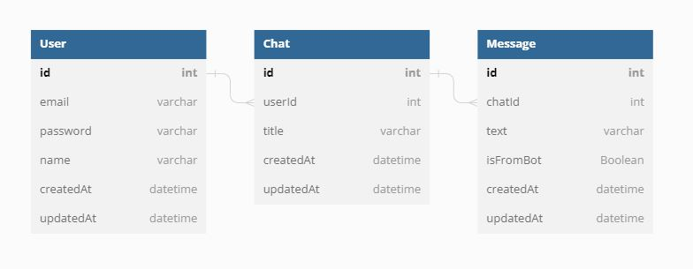
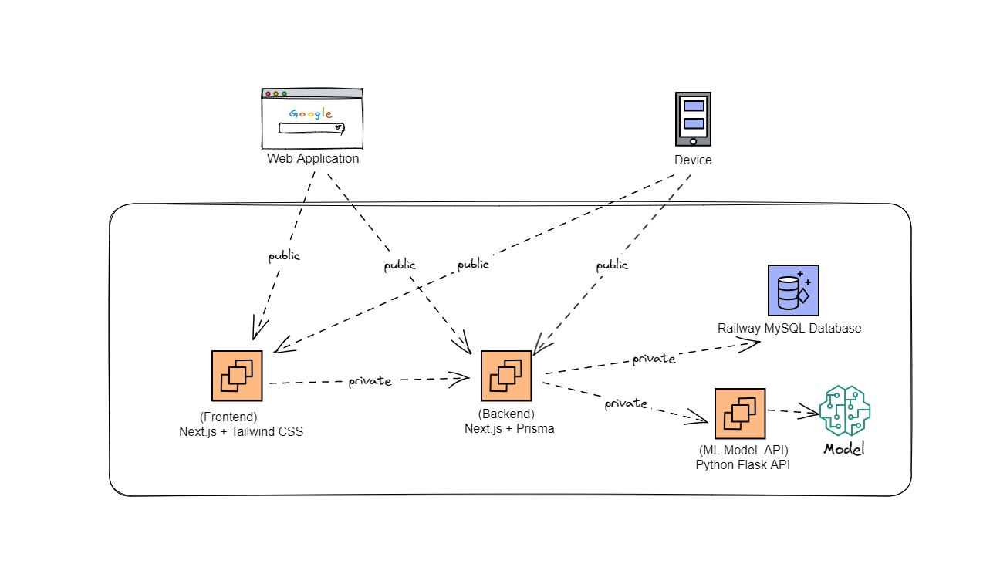
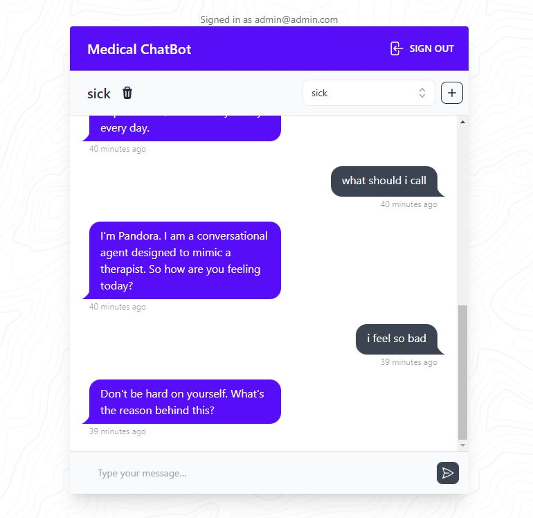

# Medical Chatbot

## Overview

This project was developed as part of the CE903 Group Project at the University of Essex. The goal of the project was to create a Medical Chatbot, and the responsibilities were distributed among the team members. In this project, I was responsible for building both the frontend and the Flask API, which serves as the communication bridge between the frontend and the chatbot model.

 

  
<strong>Entity-Relationship Diagram (ERD)</strong>

  
  
<em>Illustrating the database schema of the Medical Chatbot project.</em>

 

  
<strong>Architecture Overview</strong>

  
  
<em>Showing the interaction between the frontend, backend, and the model.</em>

 

  
<strong>Application Interface</strong>

  
  
<em>Demonstrating its user-friendly design and functionality.</em>

## Installation for the backend. 

1. Clone the repository
1. Install tensorflow: `pip install tensorflow`
1. Run training.py to train the model
1. Fire up the flask api with command: `python api.py`

## Installation for the frontend. 

1. Clone the repository from GitLab
1. Install the required dependencies for the frontend using npm: `npm install`
1. Setup the database using Prisma after configuring the .env file: `npx prisma migrate dev`
1. Start the frontend development server: `npm run dev`
1. Visit http://localhost:3000 in your web browser to access the application

